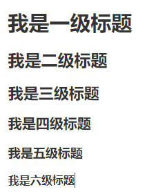

让我先讲点废话，对引入部分不感兴趣或是赶时间的同志们就跳过吧：

老早之前帮同学做文集，规模不大也就二三万字吧，当时还是个刚开化的小朋友，用的是Office的Word文档。

然后幼小的我花了一下午只顾做了排版……

还有两三万字没敲呢！

来来回回搞了那么久还贼难看，最后甲方不好意思地回绝了。

~~当然以上这个例子是我瞎编的……~~

不过事实上，在那个时候，我也经常会在写作的过程中纠结于繁杂的段落格式设置，以及被Word各种令人窒息的操作吓晕。

有没有一个优秀的写作工具能做到**高效排版专心写作**呢？

这时候伟大的Lead同志就告诉我：用Markdown啊！

啊？！这么好用的工具怎么完全没听过？

什么工具啊，这是一种标记语言！

啊？！

从那以后，我就认识到了这一完全为写作设计的标记语言，可以完美地满足我对简简单单就轻松排版、全心全意专注于写作的需求。

现在，我也向各位同志推荐这强大的写作利器。

Markdown的教程在网上可以说是数不胜数，也有不少大佬写的教程极为详尽、面面俱到。但也有不少同学对于几十页的长篇大论皱眉头，最后被相对不好的第一印象而劝退。

于是乎，我决定写一篇简明、用于速成的Markdown教程。毕竟打出了“以光速教你写Markdown”的旗号嘛。

（我博客里的文章都是用Markdown写的哦！~~才不是因为Hexo默认使用Markdown作为文章格式呢……~~）

这篇教程旨在用最短时间满足你对排版的需求，所以只讲解最必要的也是最基础的Markdown语法，读完后就可以做到做出如这篇文章一样的排版。而一些进阶内容我就放在[《光速！教你！Markdown进阶！》](https://wugiccode.github.io/2024/01/12/%E5%85%89%E9%80%9F%EF%BC%81%E6%95%99%E4%BD%A0%EF%BC%81Markdown%E8%BF%9B%E9%98%B6%EF%BC%81/)这篇文章作详细讲述了。

此外，还有一些优秀教程可以做参考：

- [Markdown 教程 | 菜鸟教程](https://www.runoob.com/markdown/md-tutorial.html)

- [我爱学习网的Markdown 入门教程](https://www.5axxw.com/wiki/topic/vxf8nl)

---

# 你先别急，先得知道什么是Markdown

借用一下[菜鸟教程](https://www.runoob.com/markdown/md-tutorial.html)的诠释：

> Markdown 是一种轻量级标记语言，它允许人们使用易读易写的纯文本格式编写文档。

画下重点奥：

- **轻量级标记语言**，主打一个轻量。这就决定了Markdown势必会广泛应用于许多网站来撰写文档或是应用于论坛上发布消息，如Github、洛谷以及简书等等。而标记语言的性质决定了它的自述性与简明性。再次强调一遍，**Markdown是一门语言，如同其他编程语言一样，是遵循其语法进行编辑的。**

- **易读易写的纯文本格式**，说简单点，就是用文本形式编辑，并用文本形式保存。也就是说，只要遵循Markdown格式与语法，**你甚至可以用记事本来编写Markdown文档**。用记事本编辑如下内容：
  
  ```markdown
  你好！我是一段`Markdown`实例。
  
  我通过**纯文本**形式编辑，以<u>这样的方式</u>呈现。
  
  > 十分好啊！
  ```
  
  渲染出来就会变成这样：（当然，你需要在支持Markdown的编辑器上渲染）
  
  ---
  
  你好！我是一段`Markdown`实例。
  
  我通过**纯文本**形式编辑，以<u>这样的方式</u>呈现。
  
  > 十分好啊！
  
  ---
  
  假如你再此用记事本打开此Markdown文件，就会呈现出上上面代码框中的源代码。而经由渲染器渲染成其他格式的文件（如`.pdf`、`.html`等），带有格式的文本就能显现出来。
  
  你可以试试用记事本打开一个Word文档（`.doc`或`.docx`文件），会发现……
  
  ```
  邢唷??                >  ?         
                            ?
          
  
  
  省略以下内容………………
  ```
  
  额，全都是乱码耶……
  
  这就是因为Word文档不是用纯文本格式保存的，而是通过编码保存为二进制格式，用记事本这种直接读取文件内容的一般文本编辑器当然是无法显示的。换句话说，如果没有Office或是WPS这种支持这种格式的工具，你是根本无法读写Word文档的。
  
  而像Markdown等标记语言则不同，只要是个文本编辑器，就可以轻松进行读写。其跨平台性是极度优秀的。

从定义出发，我们很轻易就能看出Markdown对于写作上的优势。

我个人理解的Markdown是对于html的一种抽象（毕竟Markdown也是渲染为html的嘛），并增加了可读性，更加容易学习，也对于码圈外的同学们门槛更低。更像是一个人人都能上手的写作工具。

---

# 马上开始了，但请先做好准备！

虽说可以用任何文本编辑器来编写Markdown文件，但无法时时确认文本格式的渲染效果还是很难受的~~，而且写文章搞得像扣代码一样那还不如用Word~~。也总不可能一直用寒酸的记事本写吧？

我们选择Markdown的原因之一，就在于其相当强大的编辑器！让你用超高的效率达成超于Word文档的写作体验，实时渲染出Markdown格式。

以下是几个比较优秀的免费Markdown编辑器：

- [Obsidian](https://obsidian.md/)，相当高端大气，中文汉化，并且拥有云图、大纲预览、远程同步等十分强大的功能。~~曾经用过挺长时间。~~

- [MarkText-- 一款简单而优雅的开源 Markdown 编辑器](https://www.runoob.com/w3cnote/github-marktext.html)。强推！本人在用，简约质朴，功能强大。就是不支持中文可能劝退了一部分同学……

- 码友也可用[VSCode](https://code.visualstudio.com/)并且安装相关插件，事实上，VSCode中已经默认集成了 Markdown 文档编辑插件，原生就支持高亮 Markdown 的语法。

还有许多收费的Markdown编辑器，其中不少同样十分优秀，可自己选择参考。

---

# 开始，起飞！

以下就正式开始教程内容，并且会附带源码实例。我会按照以下格式在代码框中提供源码，并展示其渲染效果。例如：

```markdown
**这是一个测试。**
```

将会渲染为：

---

**这是一个测试。**

---

同时我会用 ***粗斜体文本*** 来表示一些注意事项。就像下面这样：

***Tips:在这里会有一些我曾经踩过的坑或是特殊要求哦！请注意。***

---

## Markdown文件

Markdown文件采用`.md`或`.markdown`作为后缀名，其中保存纯文本内容。前者更为简短，较为主流。

而想要得到成品文件就要通过渲染生成，一般的Markdown编辑器都会提供渲染功能。

***Tips:请确保你在输入下文所述的符号时使用英文输入法！***

---

## 段落

何为段落？现阶段可以理解为就是换行。

在Markdown中，分段（换行）有两种实现方式：

- 在段末添加**两个**回车（即相隔一个空行）。

- 使用**两个以上空格并加上回车**。

主流方式是第一种（存疑）。

如果只是单纯敲一个回车，则会……显示为一个空格。对，我知道这很奇怪，但是习惯就好。

~~从html惯过来的毛病……~~

例如：

```markdown
我是一个段落，添加了两个回车，中间空了一行。

我是一个段落，虽然你看不见，但后面还是有两个空格的哦。  
好耶，渲染很顺利耶！

我后面只有一个回车，而且没有空格
然而渲染出来却怪怪的……
```

将会渲染为：

---

我是一个段落，添加了两个回车，中间空了一行。

我是一个段落，虽然你看不见，但后面还是有两个空格的哦。  
好耶，渲染很顺利耶！

我后面只有一个回车，而且没有空格 然而渲染出来却怪怪的……

---

***Tips:但是有些编辑器十分良心（点名表扬Marktext），替你做好了分段时打两个空格的工作，所以用这些编辑器的时候换行时正常打一个空格就好。***

~~心疼一分钟Obsidian和VSCode用户~~

---

## 字体

Markdown一脉相承地使用了html风格的字体，具有以下几种：

```markdown
*斜体，我斜了*

_斜体，我也斜了_

**粗体……没什么**

__粗体……好怪哦__

***我是上面两者的集合体！***

___俺也一样！___

~~是删除线耶~~

<u>是下划线耶</u>
```

将会渲染为：

---

*斜体，我斜了*

*斜体，我也斜了*

**粗体……没什么**

**粗体……好怪哦**

***我是上面两者的集合体！***

***俺也一样！***

~~是删除线耶~~

<u>是下划线耶</u>

---

***Tips:***

- ***粗体和斜体以及粗斜体用星号` * `或下划线`_`皆可，但尽量不要混用吧，以免惹出一些不必要的麻烦……***

- ***会html的同学也可以使用html标签，效果是一样的。***

- ***多个格式是<u>可以混合使用</u>的。***

---

## 词引用

用于段落内的引用。使用反引号\`（Esc键下方的那个按键）包裹要引用的内容以标记。例如：

```markdown
使用`Box<T>`智能指针进行堆对象分配。
```

将会渲染为：

---

使用`Box<T>`智能指针进行堆对象分配。

---

***Tips:一般用于表示片段的代码或是特殊文本。***

---

## 标题

Markdown用井号`#`表示标题，支持最深六级标题，如下：（不要忘记`#`后还有一个空格！）

```markdown
# 我是一级标题

## 我是二级标题

### 我是三级标题

#### 我是四级标题

##### 我是五级标题

###### 我是六级标题
```

将会渲染为：

---



---

实际上，Markdown还支持使用`=`和`-`标记一级和二级标题，但容易和后文的`分隔线`混淆，所以不推荐使用。这里只做展示：

```markdown
我是一级标题，注意后面只有一个回车并且没有空格！
=====

而我是二级标题
-----
```

将会渲染为：

---


---

这里的`=`和`-`数量大于等于二即可，不过还是不推荐使用。

***Tips:不建议标题建立过深，如果需要深层次列举，建议使用后文会提到的`列表`进行处理***

---

## 分隔线

可以通过在一**段落**中使用三个及以上的减号`-`、星号`*`或是下划线`_`来插入一个分隔线，并且此段不能再有其他文字。也可以在上述三种符号之间插入空格，但不建议，因为处理不好就会被识别为`列表`。

```markdown
*插入一个分隔线：*

---

*再插入一条分隔线：*

* * *

*还能再插入一条分隔线：*

_ _ _ _ _ _ _ _

*十分好。*
```

将会渲染为：

*插入一个分隔线：*

---

*再插入一条分隔线：*

---

*还能再插入一条分隔线：*

---

*十分好。*

***Tips:***

- ***留意到建立分隔线时减号（或是星号和减号）前后都空了一行了吗？这就是因为分割线必须独立成为一个段落哦。（当然Marktext编辑器直接敲一个回车就行了）***

- ***不同的渲染器，对于分割线的渲染方式是不同的。不过大多都没什么区别……***

---

## 列表

Markdown支持的列表分为无序列表和有序列表。

### 无序列表

无序列表用于对对象的简单列举，使用星号`*`、加号`+`或是减号`-`进行标记，**并在后面加上一个空格**，格式如下：

```markdown
The list goes,
+ You're right, but...
+ **Genshen Impact, START!!!**
+ I always like Reisen Udongein Inaba.

这是另一个列表：
- 第一项，这是一个列表。
- 第二项，这还是一个列表。
而且我还在列表里换了行！
- 第三项，我编不下去了……
```

将会渲染为：

---

The list goes,

- You're right, but...
- **Genshen Impact, START!!!**
- I always like Reisen Udongein Inaba.

这是另一个列表：

- 第一项，这是一个列表。
- 第二项，这还是一个列表。
  而且我还在列表里换了行！
- 第三项，我编不下去了……

---

***Tips:结束一个列表的方式是分段，也就是打两个回车。列表中换行只需打一个回车。***

---

### 有序列表

有序列表用于对对象的次序列举，使用数字加上句点`.`标记，**也别忘了在后面加上一个空格**，格式如下：

```markdown
1. 东方Project是日本同人游戏社团上海爱丽丝幻乐团所制作的一系列同人游戏。
2. 幻想乡是东方Project系列故事的主要舞台，很多时候被用来指代整个东方Project世界。
3. 燕国地图有点短……

然后还有一种写法……
1. 什么？有序列表还能只用1作标号？
1. 而且还能正常渲染？
1. 好吧，虽然很反常理但能用就能用……
```

将会渲染为：

---

1. 东方Project是日本同人游戏社团上海爱丽丝幻乐团所制作的一系列同人游戏。
2. 幻想乡是东方Project系列故事的主要舞台，很多时候被用来指代整个东方Project世界。
3. 燕国地图有点短……

然后还有一种写法……

1. 什么？有序列表还能只用1作标号？
2. 而且还能正常渲染？
3. 好吧，虽然很反常理但能用就能用……

---

***Tips:与无序列表一样，结束一个列表的方式是分段，也就是打两个回车。列表中换行只需打一个回车。***

---

### 列表嵌套

无序列表与有序列表之间是可以互相嵌套的，以达到展现层次的效果。

实现列表之间的套娃只需在子列表的项目前面添加两个或四个空格（直接一个制表符`Tab`也行），并保持层次之间缩进一致~~，学过Python的你们应该是懂的吧……~~

例如：

```markdown
1. 我是第一项，要展示的是列表嵌套
    - 第一项的第一点
    子列表中的换行也要保持缩进一致哦！
    - 第一项的第二点
2. 我是第二项
    - 第二项的第一点
    - 第二项的第二点
        - 我还能套娃！
3. 我是第三项
```

将会渲染为：

---

1. 我是第一项，要展示的是列表嵌套
   - 第一项的第一点
     子列表中的换行也要保持缩进一致哦！
   - 第一项的第二点
2. 我是第二项
   - 第二项的第一点
   - 第二项的第二点
     - 我还能套娃！
3. 我是第三项

---

***Tips:仍旧不建议列表嵌套层数过多，容易显得冗杂。***

---

## 区块/区块引用

区块一般用于对于成段内容的引用，或是对文本的标识。

在段落开头使用大于号`>`，并在其后**加上一个空格符号**来建立一个区块。例如：

```markdown
迪奥·布兰度曾经说过：
> 人的能力是有极限的……后面忘了
> 我不做人了，JOJO！

区块也是可以嵌套的，通过`>`的个数来表示层次（每个`>`之后都有一个空格）：
> 区块引用
> > 再来一层
> > > 还能套娃！

用分段表示区块结束。

区块与列表的互相嵌套：
> 区块中使用列表
> - 比如这样
> 1. 还有这样！

列表中使用区块：`>`前需要加上对应的缩进
1. 我是列表的第一项
    > 列表第一项中的区块
    > 十分甚至九分的好啊！
2. 我是列表的第二项
```

将会渲染为：

---

迪奥·布兰度曾经说过：

> 人的能力是有极限的……后面忘了
> 我不做人了，JOJO！

区块也是可以嵌套的，通过`>`的个数来表示层次（每个`>`之后都有一个空格）：

> 区块引用
> 
> > 再来一层
> > 
> > > 还能套娃！

用分段表示区块结束。

区块与列表的互相嵌套：

> 区块中使用列表
> 
> - 比如这样
> 1. 还有这样！

列表中使用区块：`>`前需要加上对应的缩进

1. 我是列表的第一项
   
   > 列表第一项中的区块
   > 十分甚至九分的好啊！

2. 我是列表的第二项

---

***Tips:注意区块与列表互相嵌套时要确保层次清晰。***

---

## 字符转义

上文所说的那——么多的标识字符，由于可能会被渲染器辨认为格式标识，所以想要正常输出，最好进行**转义**。

只需在特殊字符前添加**反斜杠`\`（请注意斜杠方向）** 即可，例如：

```markdown
经过转义后，下面的字符（注意都是英文字符）都是可以放心地正常输出的！

\` \~ \! \# \$ \* \+ \- \_ \> \( \) \[ \] \. \| 等字符

同样，要输出反斜杠`\`，就要连续加上两个反斜杠：\\
```

将会渲染为：

---

经过转义后，下面的字符（注意都是英文字符）都是可以放心地正常输出的！

\` \~ \! \# \$ \* \+ \- \_ \> \[ \] \. \| 等字符

同样，要输出反斜杠`\`，就要连续加上两个反斜杠：\\

---

***Tips：中文字符什么的不影响，正常输入即可。***

---

# 后记

以上就是进行Markdown写作所要求的**最基本也是最常用**内容，熟练掌握就已经能够做出相当不错的排版了。相关进阶内容还有：

- 脚注

- 代码块

- 超链接

- 表格

- HTML元素

- KaTeX或MathJax实现的数学公式

均会在[《光速！教你！Markdown进阶！》](https://wugiccode.github.io/2024/01/12/%E5%85%89%E9%80%9F%EF%BC%81%E6%95%99%E4%BD%A0%EF%BC%81Markdown%E8%BF%9B%E9%98%B6%EF%BC%81/)这篇文章中做详细介绍。

希望各位同学善用这一强大的利器哦！
